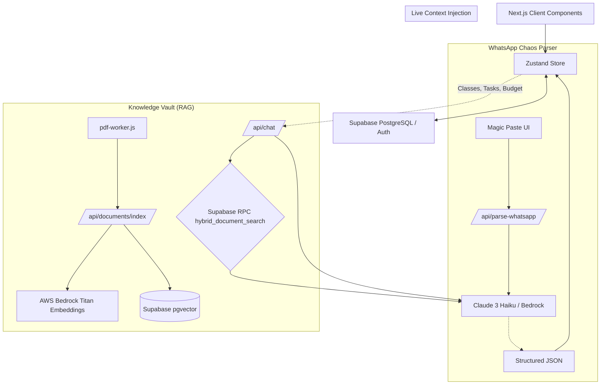

# CampusFlow — AI Student Operating System
*(Amazon HackOn Season 6.0 Submission)*

CampusFlow is a production-grade, unified AI Dashboard designed specifically for the realities of student living. It elegantly combines both HackOn themes—**CampusFlow (Academic OS)** and **PocketBuddy (Finance & Wellness)**—into a single, seamless, intelligent application powered by **AWS Bedrock**.

It replaces the chaos of WhatsApp groups, student portals, emails, budgeting apps, and messy spreadsheets with an AI that proactively manages your academic, financial, and emotional life.

---

## 🏆 Key "Hackathon-Winning" AI Features
*These are the flagship features built to showcase technical depth and creativity for the judges.*

### 1. "Magic Paste" WhatsApp Chaos Parser
Student life runs on chaotic WhatsApp groups. Our custom AI parser fixes this:
*   **Feature:** A dedicated input box on the dashboard to paste messy, unstructured text (e.g., *"Hey guys, CS101 is cancelled tmrw but assignment 3 is due Friday 5PM! Also tech club meeting at 6 in LHC."*).
*   **AWS Magic:** We use **AWS Bedrock** to instantly parse the unstructured text into a strict JSON schema.
*   **Action:** The app automatically updates the database: it cancels the class in the Attendance tracker, adds a High-priority task to the Task Manager, and adds the meeting to the Campus Events Radar.

### 2. Context-Aware AI Chatbot with Voice 
Most chatbots only know general information. CampusFlow's AI knows *you*.
*   **Live Dashboard Context Injection:** When you ask the AI a question, we silently inject your live schedule, current tasks, budget data, and wellness logs into the system prompt.
*   **Example Use Case:** You ask, *"Can I skip my next class?"* The AI checks your schedule, sees your next class is Physics, checks your attendance percentage, cross-references your recent stress logs, and replies: *"Yes, your attendance is at 88% and you've logged high stress for 2 days. You can safely skip to rest."*
*   **Voice Assistant:** Built-in microphone support utilizing `window.SpeechRecognition` so students can talk to their AI assistant hands-free while walking across campus.

### 3. Smart AI Interventions (Proactive Help)
The Daily Digest banner at the top of the dashboard doesn't just show data; it provides **AWS AI Suggestions**:
*   **Financial Intervention:** If you overspend on transport, the AI explicitly suggests switching to the Campus Shuttle to save money.
*   **Burnout Detection:** If you log high stress and low sleep for consecutive days, the AI warns you of impending burnout and suggests schedule adjustments.

### 4. Advanced Knowledge Vault (RAG Pipeline)
A fully functional Retrieval-Augmented Generation (RAG) pipeline to chat with your syllabi, notes, and research papers.
*   **Storage:** Files are uploaded to Supabase Storage (backed by S3).
*   **Processing:** A custom Node.js background worker thread (`pdf-worker.js`) extracts text safely without blocking the main server.
*   **AWS Integration:** Text is chunked and embedded using **AWS Bedrock Titan Embeddings V2**.
*   **Vector Search:** Stored in Supabase `pgvector`. When you ask a question, we use a custom PostgreSQL RPC to perform a **Hybrid Search** (Semantic Vector Matching + Full-Text Keyword Search) for highly accurate answers.

---

## 📊 Comprehensive Feature List (Video Checklist)

If you are recording a video demo, go through these features one by one:

### 🏠 The Dashboard (Core OS)
- [ ] **AI Daily Digest:** The glowing banner at the top that calculates urgent tasks, attendance warnings, and burnout risks dynamically.
- [ ] **Today's Timeline:** A beautiful vertical timeline showing your classes for the current day.
- [ ] **Task Prioritizer:** Add, edit, and check off tasks. Sorted automatically by urgency (High/Medium/Low).
- [ ] **Attendance Tracker:** Visual progress bars for every subject. Turns red if you drop below the critical 75% threshold.

### 💰 PocketBuddy (Finance)
- [ ] **Expense Tracker:** Add expenses with categories (Food, Transport, Academics, Fun).
- [ ] **Monthly Budget Goals:** Set limits for different categories.
- [ ] **Visual Analytics:** Progress bars showing how much of your budget you've consumed this month.

### 🧘 PocketBuddy (Wellness)
- [ ] **Daily Check-in:** Log your mood (emoji), stress level (1-5), and hours slept.
- [ ] **History View:** A beautiful timeline of your mental health over the past week.
- [ ] **Burnout Algorithm:** The system calculates risk based on consecutive days of high stress + low sleep.

### 📡 Campus Radar
- [ ] **Community Events:** Create and view public campus events (e.g., Hackathons, Club meetings, Fests).
- [ ] **Official Notices:** View admin-level notices (e.g., Hostel updates, Placement drives).
- [ ] **Read Receipts:** Click a notice to mark it as read. This state is saved persistently to your specific user profile via a `JSONB` column in Supabase.

### 🧠 Knowledge Vault (Document AI)
- [ ] **Drag & Drop Upload:** Upload PDFs.
- [ ] **Live Indexing Status:** Watch the badges change from "Indexing" (spinner) to "Indexed" (green check) as the AWS Bedrock pipeline processes the file in the background.
- [ ] **File Management:** Search, filter, and delete documents.

### 💬 The AI Chat Assistant
- [ ] **Floating Brain Button:** Click the pulsing brain icon in the bottom right.
- [ ] **Voice Input:** Click the microphone and speak your query.
- [ ] **Ask about Documents:** e.g., *"Summarize the syllabus I just uploaded."*
- [ ] **Ask about your Life:** e.g., *"How much have I spent on food this month?"*

---

## 🏗 Architecture & Data Flow



## 🛠 Tech Stack

*   **Frontend:** Next.js 14 (App Router), React, Tailwind CSS, Framer Motion, Zustand
*   **Backend & Database:** Supabase (PostgreSQL, pgvector, Row Level Security, Auth)
*   **AI Models:** AWS Bedrock (Titan Embeddings V2), Anthropic Claude 3 Haiku
*   **Data Processing:** Custom Node.js worker threads for PDF parsing to ensure Vercel/Edge compatibility.

---

## 📦 Setup Instructions

### 1. Clone & Install
```bash
git clone https://github.com/gaarushi11/CampusSphere-AI-Student-Operating-System.git
cd CampusSphere-AI-Student-Operating-System
npm install
```

### 2. Environment Variables (`.env.local`)
```env
NEXT_PUBLIC_SUPABASE_URL=your_supabase_url
NEXT_PUBLIC_SUPABASE_ANON_KEY=your_supabase_anon_key
SUPABASE_SERVICE_ROLE_KEY=your_supabase_service_role_key

# For RAG Indexing
AWS_ACCESS_KEY_ID=your_aws_access_key
AWS_SECRET_ACCESS_KEY=your_aws_secret_key
AWS_REGION=us-east-1

# For Chat & WhatsApp Parser
OPEN_ROUTER_API_KEY=your_openrouter_key
```

### 3. Database Migration
Run the following SQL files in your Supabase SQL Editor in exact order:
1.  `SUPABASE_SETUP.sql`
2.  `SUPABASE_MIGRATION_V3.sql` (If applicable)
3.  `SUPABASE_MIGRATION_V5.sql`

*Also ensure you have created a storage bucket named `vault_files` in Supabase.*

### 4. Run Locally
```bash
npm run dev
```
Open [http://localhost:3000](http://localhost:3000).
