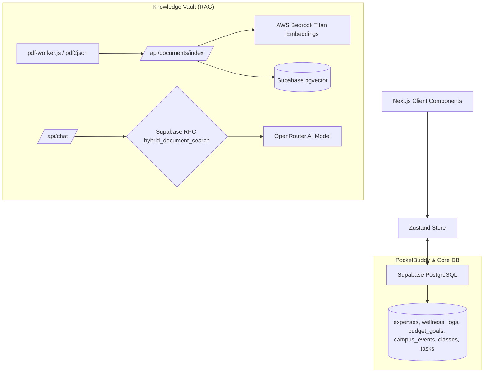

# CampusFlow — AI Student Operating System

CampusFlow is a production-grade, AI-powered unified dashboard for students. It replaces the chaos of WhatsApp groups, student portals, emails, and messy spreadsheets with a single, intelligent interface. 

Built with **Next.js 14**, **Supabase**, and **AWS Bedrock**, CampusFlow offers a robust architecture including an advanced RAG (Retrieval-Augmented Generation) pipeline for semantic document search, a PocketBuddy financial/wellness tracker, and a dynamic campus event radar.

## 🚀 Key Features

*   **Intelligent Dashboard:** AI Daily Digest that surfaces urgent tasks, low attendance warnings, budget overspends, and burnout risks.
*   **Knowledge Vault (RAG Pipeline):** Upload academic PDFs/PPTs. The system extracts text via a robust background worker, chunks it, embeds it using AWS Titan, and stores it in Supabase Vector. You can then chat with your documents using semantic hybrid search.
*   **PocketBuddy:** A complete financial and wellness module. Track expenses by category, set monthly budget limits, log daily mood/sleep/stress, and get warned about burnout risks.
*   **Campus Radar:** A real-time notice board and campus event system. Create campus-wide events, see upcoming hackathons or club meetings, and read urgent administrative notices.
*   **Task & Attendance Manager:** Keep track of class schedules, calculate attendance percentages in real-time, and manage prioritized tasks.

## 🏗 Architecture



## 🛠 Tech Stack

*   **Frontend:** Next.js 14 (App Router), React, Tailwind CSS, Framer Motion, Zustand
*   **Backend & Database:** Supabase (PostgreSQL, pgvector, Row Level Security, Auth)
*   **AI Models:** AWS Bedrock (Titan Embeddings V2), OpenRouter (Claude/Gemini for chat)
*   **PDF Extraction:** `pdf2json` running in an isolated background Node worker thread

## 📦 Setup Instructions

### 1. Clone the Repository
```bash
git clone https://github.com/gaarushi11/CampusSphere-AI-Student-Operating-System.git
cd CampusSphere-AI-Student-Operating-System
npm install
```

### 2. Environment Variables
Create a `.env.local` file in the root directory:
```env
NEXT_PUBLIC_SUPABASE_URL=your_supabase_url
NEXT_PUBLIC_SUPABASE_ANON_KEY=your_supabase_anon_key
SUPABASE_SERVICE_ROLE_KEY=your_supabase_service_role_key

AWS_ACCESS_KEY_ID=your_aws_access_key
AWS_SECRET_ACCESS_KEY=your_aws_secret_key
AWS_REGION=us-east-1

OPEN_ROUTER_API_KEY=your_openrouter_key
```

### 3. Database Migration
Run the following SQL files in your Supabase SQL Editor in this exact order:
1.  `SUPABASE_SETUP.sql` — Creates the base tables (profiles, classes, tasks, documents), the vector schema, and the RPC functions for RAG.
2.  `SUPABASE_MIGRATION_V5.sql` — Creates the PocketBuddy tables (expenses, budget_goals, wellness_logs), the campus_events table, and sets up settings persistence.

### 4. Run the Development Server
```bash
npm run dev
```
Open [http://localhost:3000](http://localhost:3000) with your browser.

## 🔐 Database Schema (Key Tables)

*   `profiles`: User details and JSONB settings.
*   `documents` & `document_chunks`: RAG pipeline storage with 1024-dimensional vector embeddings.
*   `expenses`: Financial transactions.
*   `budget_goals`: Monthly spending limits per category.
*   `wellness_logs`: Daily mood, sleep, and stress tracking.
*   `campus_events`: User-created events visible to all authenticated users.

All tables are protected by Supabase Row Level Security (RLS) policies to ensure data privacy.

## ⚠️ Important Note on PDF Extraction
The project uses a custom Node.js worker thread (`pdf-worker.js`) combined with `pdf2json` to reliably extract text from complex academic PDFs. This approach was chosen to bypass the limitations and crash issues of standard `pdf-parse` in Next.js Edge runtime environments.
